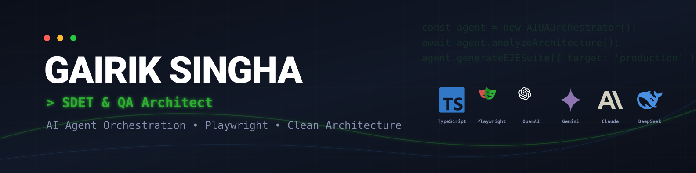
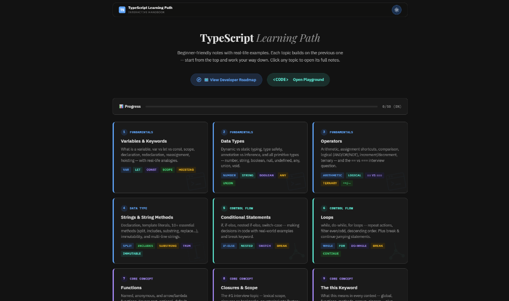
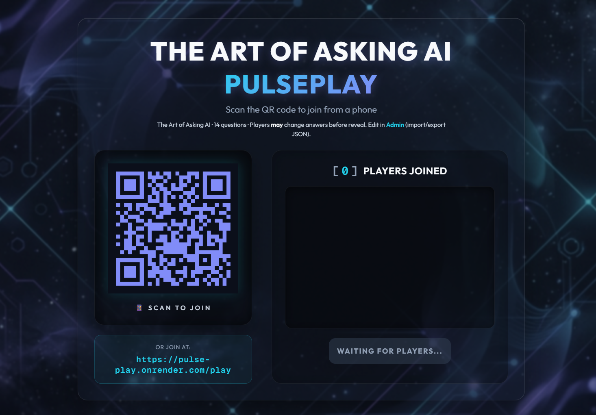
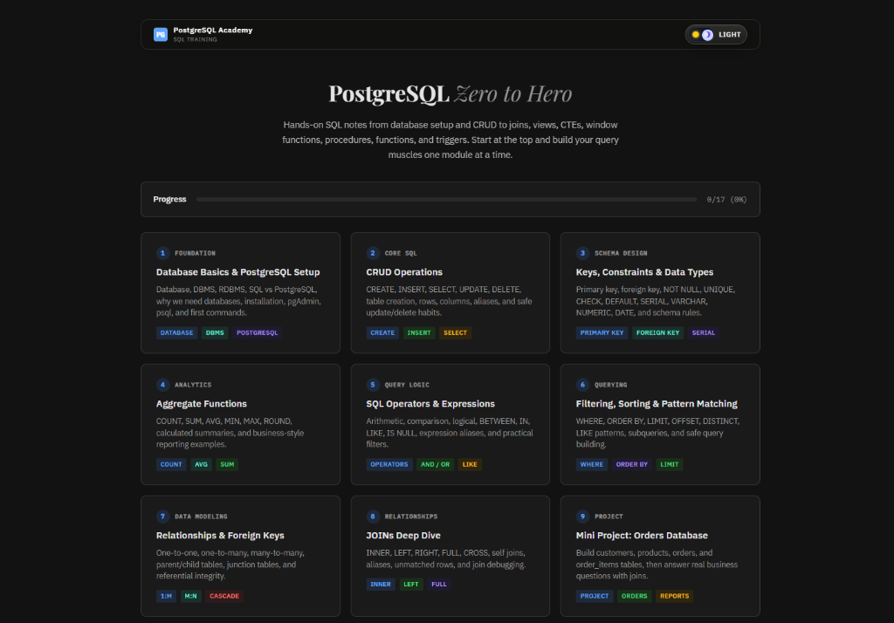

 

 

**Architect of intelligent automation frameworks and scalable testing infrastructure,**
**focused on AI Agent Orchestration and Clean Architecture principles.**
**Specialist in robust Playwright & TypeScript E2E suites with parallel CI/CD execution,**
**and deep backend validation across AWS, GraphQL APIs, and PostgreSQL.**

📍 India &nbsp;·&nbsp; <!-- DYNAMIC:EXPERIENCE_START -->7 Years, 3 Months and 6 Days<!-- DYNAMIC:EXPERIENCE_END --> in Software QA &nbsp;·&nbsp; SDET & Automation Specialist

 

<!-- DYNAMIC:LEARNING_START --><!-- DYNAMIC:LEARNING_END -->

 

## 🚀 Independent Projects

> **💡 Personal Portfolio Note:** All projects listed below are 100% independently designed, engineered, and maintained by me as personal portfolio pieces, not company products.

 

<table width="100%" border="0" style="border-collapse: collapse;">
  <tr>
    <td width="50%" valign="top" style="padding: 10px;">
      <h3 align="center">🤖 <a href="https://github.com/for-qa/agentic-e2e-framework">Agentic E2E Framework</a></h3>
      

        
          
        
         
        <!-- DYNAMIC:TEST_HEALTH_START -->
**Nightly E2E Status:** 🟢 100% Passed (Last run: 3/25/2026)
<!-- DYNAMIC:TEST_HEALTH_END -->
      

      
An enterprise-grade <b>Playwright + TypeScript</b> test suite built <b>100% via AI Agent Orchestration</b>.

    </td>
    <td width="50%" valign="top" style="padding: 10px;">
      <h3 align="center">🗄️ <a href="https://query-canvas.pages.dev/">QueryCanvas</a></h3>
      

        
          
        
      

      
A <b>visual SQL development suite</b> with a built-in AI Assistant for Prompt-to-SQL execution.

    </td>
  </tr>
  <tr>
    <td width="50%" valign="top" style="padding: 10px;">
      <h3 align="center">⚡ <a href="https://ts-age.pages.dev/">TypeScript Learning Path</a></h3>
      

        
          
        
      

      
An interactive platform guiding developers from <b>TypeScript fundamentals to production-grade patterns</b>.

    </td>
    <td width="50%" valign="top" style="padding: 10px;">
      <h3 align="center">🎮 <a href="https://pulse-play.onrender.com/host">PulsePlay</a></h3>
      

        
          
        
      

      
An interactive, real-time <b>multiplayer Kahoot-style quiz platform</b> built with Socket.IO.

    </td>
  </tr>
  <tr>
    <td width="50%" valign="top" style="padding: 10px;">
      <h3 align="center">🐘 <a href="https://pgsql-academy.pages.dev/">PostgreSQL Academy</a></h3>
      

        
          
        
      

      
A hands-on <b>SQL training platform</b> covering schema design, CRUD, and advanced CTEs.

    </td>
    <td width="50%" valign="top" style="padding: 10px;">
      <h3 align="center">⚙️ <a href="https://github.com/for-qa/xtractor">Xtractor Dashboard</a></h3>
      

        
          
        
      

      
A high-performance extraction orchestrator built on <b>Clean Architecture</b> constraints.

    </td>
  </tr>
</table>

 

## 🛠️ Tech Stack & Expertise

  

 

| Domain | Core Competencies |
| :---: | :---: |
| **QA & Testing** | Playwright · E2E Automation · UI/API Testing · GraphQL & REST · Jira Xray · Sentry |
| **AI Engineering** | Agentic Workflows · Prompt Engineering · LLMs (Claude/GPT-4o/Gemini) · Cursor IDE |
| **Backend & Cloud** | Node.js · AWS (Lambda, S3, EC2) · PostgreSQL · SQLite · Clean Architecture · SOLID |
| **DevOps & CI-CD** | GitHub Actions · Bitbucket Pipelines · Parallel Shard Execution · Agile Scrum · Vitest |

 

## 💼 Professional Experience

> **SDET / QA Architect** @ _Intelligent Revenue LLP_ (Dec 2024 – Present) Designed enterprise **Playwright + TypeScript** E2E framework using Clean Architecture and **AI Agent Orchestration**. Validated AWS cloud infrastructure (Lambda, EC2, S3), REST/GraphQL APIs, and PostgreSQL databases.

> **Senior Quality Assurance Executive** @ _Avalgate Software LLP_ (Mar 2021 – Nov 2024) Led end-to-end QA for Android, iOS, and web apps across 4 major products. Reduced critical bugs by 25% via systematic black-box testing and maintained STLC documentation in Jira.

> **Junior QA / Internship Trainee** @ _Avalgate Software LLP_ (Apr 2019 – Feb 2021) Executed functional test cases across Android, iOS & web through the full bug lifecycle.

 

## 📈 GitHub Stats

<!-- DYNAMIC:WAKATIME_START -->
<!-- DYNAMIC:WAKATIME_END -->

 

## 📬 Get In Touch

I'm always open to discussing Software Quality, Automation Architecture, or AI Engineering.

📧 **Email**: [gairiksingha@live.com](mailto:gairiksingha@live.com) &nbsp;&nbsp;|&nbsp;&nbsp; 💼 **LinkedIn**: [linkedin.com/in/gairik-singha](https://www.linkedin.com/in/gairik-singha/)

 

  
<i>"The future of QA is not writing tests manually — it's orchestrating agents that write them for you."</i>

