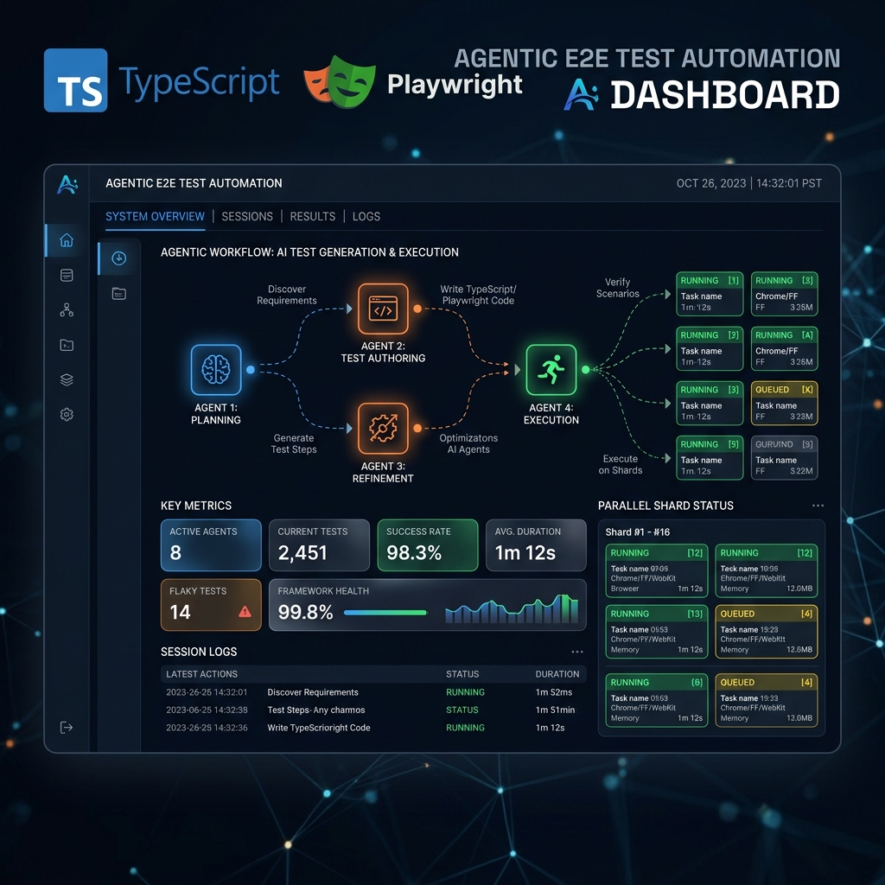
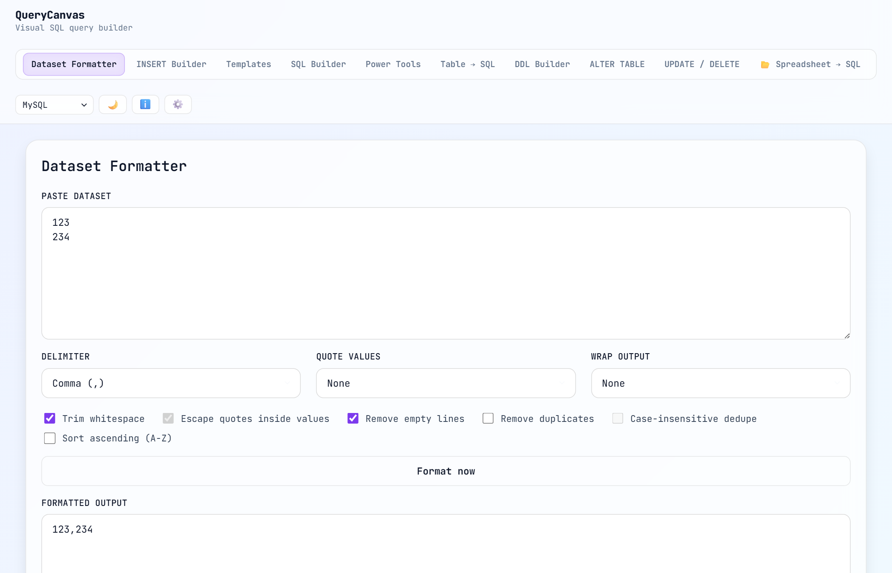
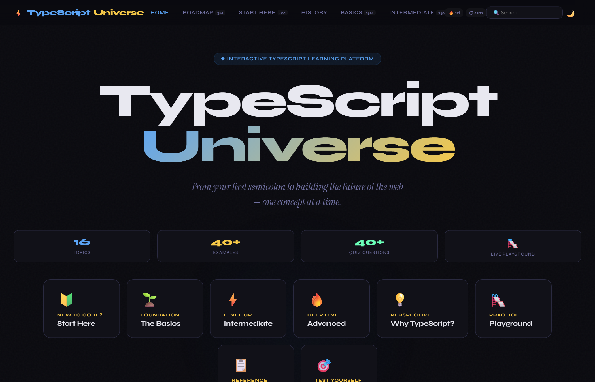
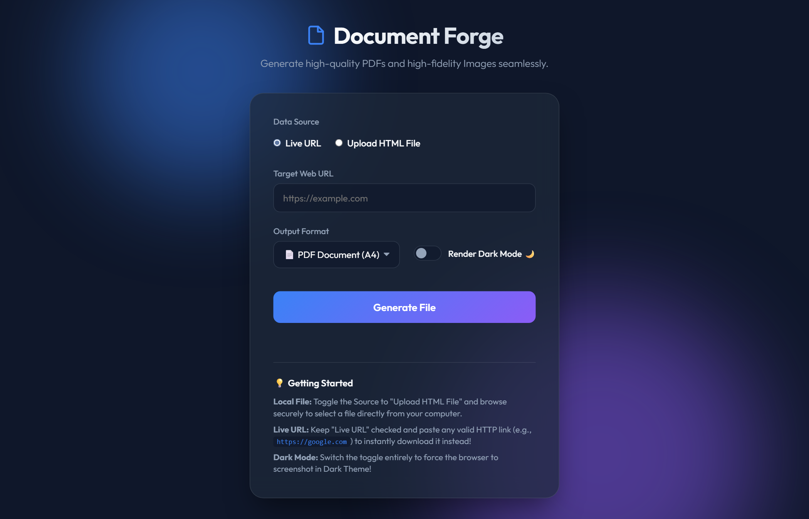

# 👋 Hey, I'm Gairik Singha

### SDET & QA Architect · Playwright · TypeScript · AWS · GraphQL · AI Agents

_I build enterprise-grade automation frameworks and high-performance backend systems —_
_engineered with AI Agent Orchestration and Clean Architecture principles._

📍 India &nbsp;·&nbsp; 7+ Years in Software QA &nbsp;·&nbsp; SDET & Automation Specialist

---

---

## 🚀 Featured Projects

### 🤖 [Agentic E2E Framework — Portfolio Demo](https://github.com/for-qa/agentic-e2e-framework)

> An enterprise-grade **Playwright + TypeScript** test suite built **100% via AI Agent Orchestration**.

- 🧠 Entire codebase generated using multi-step AI Agent workflows
- 📋 Every test case maps directly to business Acceptance Criteria via structured prompt engineering
- ⚙️ Modular `TestSuiteConfiguration` system with priority-based parallel scheduling and shard tagging
- 🏗️ Follows **ISTQB CT-GenAI** principles: agent orchestration, prompt engineering, and AI risk mitigation
- ✅ Unit-tested framework utilities with Vitest (path normalization, retry logic, data generators)

`Playwright` `TypeScript` `Vitest` `AI Agents` `Prompt Engineering` `Clean Architecture` `GitHub Actions`

---

### ⚡ [Xtractor](https://github.com/for-qa/xtractor)

> A **Professional, High-Performance Extraction Orchestrator & Dashboard** built on Clean Architecture constraints.

- 📊 Real-time Dashboard with P50/P95/P99 latency analytics and throughput charts
- ☁️ AWS S3 sync with SHA-256 integrity checks and resumable checkpointing
- ⏰ Smart Cron Manager with SQLite-backed persistence for multi-tenant batch jobs
- 📧 Automated HTML Failure Reports via SMTP/Nodemailer
- 🔐 Fernet-encrypted secrets for secure credential management

`TypeScript` `AWS S3` `SQLite` `Clean Architecture` `SOLID` `Node.js` `GitHub Actions`

---

### 🗄️ [QueryCanvas](https://query-canvas.pages.dev/)

> A **comprehensive visual SQL development suite**—acts as a daily toolbox for building complex queries without writing code manually.

- 🧠 **AI Assistant**: Real natural language Prompt-to-SQL logic execution powered by Gemini 2.0 Flash
- 📊 Interactive Grid: Spreadsheet-like grid system that safely handles and executes Batch INSERT commands
- 🔗 Deeply Shareable: URL-encoded serialization allowing you to send live DB designs to colleagues instantly
- 📝 ERD Visualizer: Live-rendering Mermaid ERD previews of schema designs
- ✨ Browser Native: 100% Client-Side. Your connection details and DB structures remain fully private.

`React` `TypeScript` `Agentic AI` `Vite`

---

### ⚡ [TypeScript Universe](https://ts-universe.pages.dev/)

> An interactive, learner-centric **TypeScript educational platform** implemented completely devoid of heavy frontend frameworks.

- 🎬 Karaoke-Style Presentations with TTS voiceover and synchronized subtitles
- 🎯 Spaced Repetition Review queue for managing incorrectly answered cards
- 🔥 Study Tracker with persistent daily-login streak counter
- 🧠 Built utilizing **SOLID principles** and Clean Architecture for the Vanilla Typescript engine
- 🛝 Integrated Playground with Monaco code editor for real-time experiments

`TypeScript` `Vanilla JS/TS` `Vite` `Clean Architecture` `SOLID`

---

### 📄 [Document Forge](https://document-forge.onrender.com/)

> A modern Web Application and Express REST API powered by Playwright to convert live URLs to high-quality PDFs and PNG images. *(Note: Render free tier spins down on inactivity. Please allow 30–60 seconds for the initial wake-up load.)*

- 🌐 Modern Web UI for uploading HTML files or URLs seamlessly
- 🔌 Programmatic REST API endpoints with multipart form-data payload support
- 📏 Custom viewports and dark-mode rendering configurations
- ⚡ Headless browser generation utilizing Chromium underneath

`Node.js` `Express` `Playwright` `E2E Testing Engine` `API`

---

### 🎯 [Flakeless](https://flakeless.onrender.com/)

> A **professional Playwright & TypeScript interview mastery platform** featuring 300+ real-world interview questions, timed mock practices, and interactive flashcards. *(Note: Render free tier spins down on inactivity. Please allow 30–60 seconds for the initial wake-up load.)*

- 📚 **Comprehensive Curriculum**: 20 highly-structured chapters covering everything from TypeScript core to enterprise-scale parallel execution and visual testing.
- 🧠 **AI-Backed Interviewer**: Interactive mock interviews with custom prompt guidelines and real-time self-assessment analytics.
- ⚡ **Offline-Ready PWA**: Fully functional offline study mode with persistent `localStorage` progress tracking and Zustand state management.
- 🧪 **Continuous Integration**: Validated by a high-performance Playwright E2E pipeline run in 4 parallel shards on GitHub Actions.

`Next.js` `TypeScript` `Tailwind CSS` `Zustand` `Framer Motion` `Playwright E2E` `Vitest` `PWA`

---

### 🎮 PulsePlay

> An **interactive, real-time multiplayer Kahoot-style quiz platform** engineered for high-engagement live workshops and classes. *(Note: Render free tier spins down on inactivity. Please allow 30–60 seconds for the initial wake-up load.)*

🔗 **Live Access Links:**
*   🎮 **[Player App](https://pulse-play.onrender.com/play)** (For participants to join and play)
*   💻 **[Host Screen](https://pulse-play.onrender.com/host?host_token=gairik-qa)** (For presenters to run live sessions)
*   ⚙️ **[Admin Control Panel](https://pulse-play.onrender.com/admin?admin_token=gairik-qa)** (For managing quiz catalog & questions)

- 🔄 **Real-Time Synchronization**: Built on Socket.IO for sub-millisecond game state synchronization between the presenter's screen and players' mobile devices.
- 🛡️ **Anti-Cheating Engine**: Strict device-identity matching and a three-strike automatic ban policy to mitigate unauthorized refreshes or duplicate entries.
- 📊 **Live Leaderboards & Reporting**: Features beautiful live ranking charts, hoverable results breakdown, and automated professional PDF report generation.
- 🏗️ **Clean Architecture**: Deeply decoupled codebase using dependency inversion, separate core game logic, and port-driven adapters.

`Node.js` `TypeScript` `Express` `Socket.IO` `Vite` `Vanilla JS` `Mermaid.js` `PDFKit`

---

### 🧠 [The Meta-Prompting Playbook](https://meta-prompt.pages.dev/)

> A **high-fidelity, automated workshop slide deck** teaching advanced prompt engineering patterns through synchronized AI-voice narration and karaoke-style subtitles.

- 🎬 **Karaoke-Style Synchronization**: Character-level audio-subtitle alignment highlighting text exactly as the AI voice narrator speaks.
- 🎤 **AI Narration Engine**: Dynamically generated, high-quality audio files generated via character-aligned ElevenLabs TTS APIs.
- 💡 **RCEC Framework Focus**: Deep dives into practical prompting strategies (Role, Context, Examples, Constraints) with real-world debugging workflows.
- 💎 **Premium Dark UI**: Implemented in 100% pure vanilla HTML5/CSS3 with glassmorphism, neon accents, and sleek hardware-accelerated animations.

`Vanilla JS` `HTML5` `CSS3` `ElevenLabs API` `Vite` `Text-to-Speech`

---

### ⚡ [TypeScript Learning Path](https://ts-age.pages.dev/)

> An **interactive, session-by-session educational platform** designed to guide developers from TypeScript fundamentals to production-grade design patterns.

- 🎓 **Interactive Quizzes & Practice**: Hands-on coding exercises and live-validated review questions covering falsy values, null-handling, and edge cases.
- 🔒 **Zero Trust Protected**: Securely deployed under a private repository workflow using **Cloudflare Access (Zero Trust)** OTP authorization for private access.
- 📦 **Local Assets & Performance**: Leverages offline-first font packages, Vite PWA registration, and aggressive client caching to achieve instantaneous loads.
- 🏗️ **Clean Code Architecture**: Modular curriculum-driven design separating practice tasks, content pages, and application layout.

`React` `TypeScript` `React Router` `Zustand` `Vite` `Vite PWA`

---

### 🧪 [CaseFile](https://case-file.pages.dev/)

> ⚠️ **Status: In Progress (Scaffolding Complete)** — An **AI-Powered Test Case Generation Platform** designed for QA and SDET architects to generate structured, rule-aware test cases from requirements or tickets.

- 🤖 **AI-Driven Test Generation**: Converts requirements or tickets into comprehensive, structured test suites using custom guidelines and model providers (OpenAI GPT-4o & Google Gemini).
- 🎫 **Smart Ticket Integration**: Built-in support to auto-detect and fetch content directly from GitHub Issues, Jira, Linear, Azure DevOps, and Zoho Sprints URLs.
- 📊 **Smart Analysis & Deduplication**: Real-time coverage classification (API, UI, Security, Performance) and Jaccard-similarity duplicate test case warnings.
- 👥 **Team & Cloud Sync**: Full user authentication and team sharing backed by Supabase with Row Level Security (RLS), falling back to native `localStorage` for offline support.
- 📤 **Enterprise Export**: Export test cases seamlessly to CSV, JSON, Markdown, and Jira XRAY / Zephyr formats.

`TypeScript` `Vite` `React` `Google Gemini API` `OpenAI API` `Supabase` `Vanilla CSS` `Clean Architecture`

---

## 🛠️ Tech Stack

---

## 🧠 Core Skills

| Domain              | Skills                                                                                                    |
| ------------------- | --------------------------------------------------------------------------------------------------------- |
| **QA & Testing**    | Playwright · E2E Automation · UI/API Testing · GraphQL & REST · Jira Xray · Sentry & Highlight.io         |
| **AI Engineering**  | Agentic Workflows · Prompt Engineering · Claude / GPT-4o / Gemini / Perplexity · Cursor IDE · Antigravity |
| **Backend & Cloud** | TypeScript · Node.js · AWS (Lambda, S3, EC2, CloudWatch) · PostgreSQL · DataGrip · Clean Architecture     |
| **DevOps / CI-CD**  | GitHub Actions · Bitbucket Pipelines · Parallel Shard Execution · Agile Scrum · Vitest                    |

---

## 💼 Professional Experience

**SDET / QA Analyst** @ _Intelligent Revenue LLP_ (Dec 2024 – Present)

- Designed enterprise **Playwright + TypeScript** E2E framework using Clean Architecture and **AI Agent Orchestration**.
- Validated AWS cloud infrastructure (Lambda, EC2, S3), REST/GraphQL APIs, and PostgreSQL databases.
- Implemented parallel shard CI/CD in Bitbucket Pipelines and managed Scrum sprints via Jira Xray.

**Senior Quality Assurance Executive** @ _Avalgate Software LLP_ (Mar 2021 – Nov 2024)

- Led end-to-end QA for Android, iOS, and web apps across 4 major products.
- Reduced critical bugs by 25% via systematic black-box testing and maintained STLC documentation in Jira.

**Junior QA / Internship Trainee** @ _Avalgate Software LLP_ (Apr 2019 – Feb 2021)

- Executed functional test cases across Android, iOS & web through the full bug lifecycle.

---

## 📈 GitHub Stats

---

## 📬 Get In Touch

I'm actively looking for **SDET / Senior QA Automation / AI Quality Engineering** opportunities.

|                 |                                                                             |
| --------------- | --------------------------------------------------------------------------- |
| 📧 **Email**    | [gairiksingha@live.com](mailto:gairiksingha@live.com)                       |
| 💼 **LinkedIn** | [linkedin.com/in/gairik-singha](https://www.linkedin.com/in/gairik-singha/) |
| 🐙 **GitHub**   | [github.com/for-qa](https://github.com/for-qa)                              |

> Response time: usually within 24 hours.

---

_"The future of QA is not writing tests manually — it's orchestrating agents that write them for you."_

